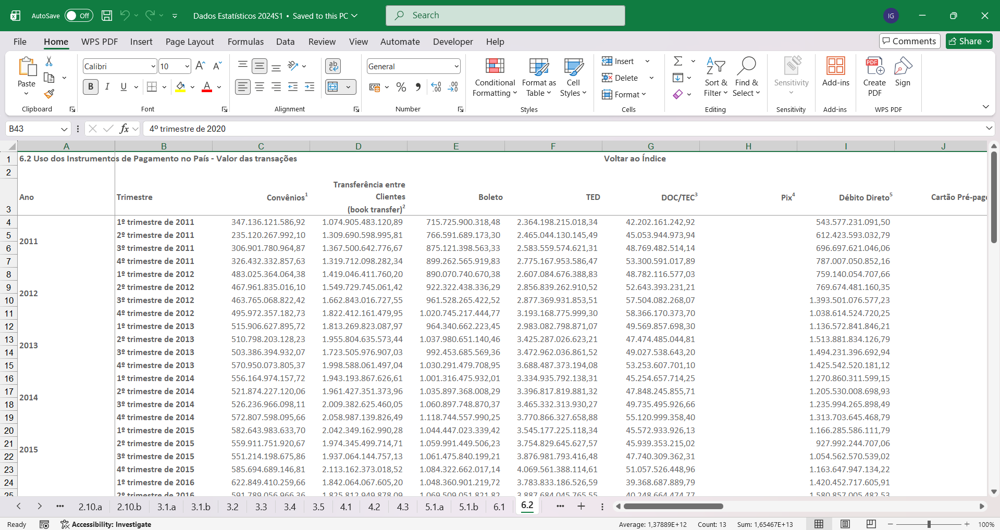
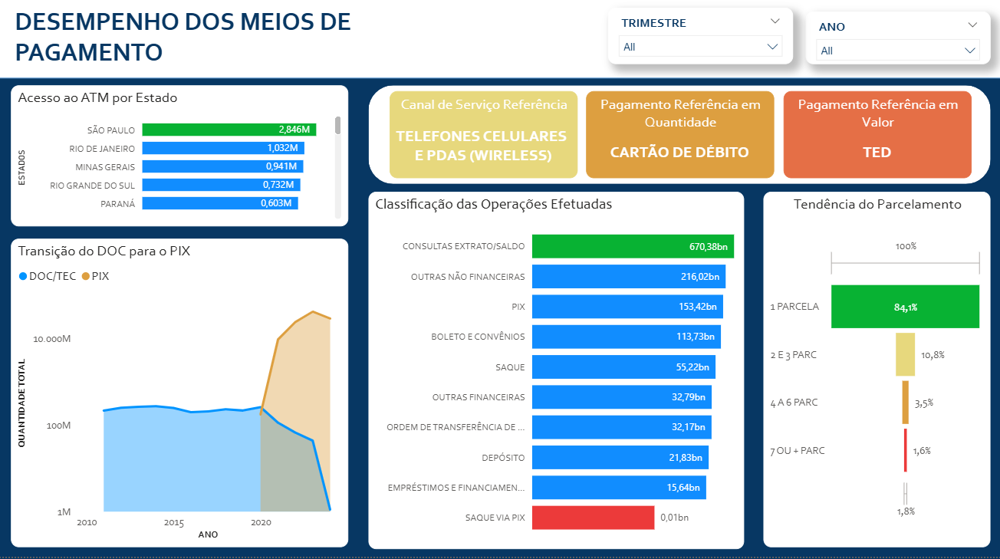

# DASHBOARD - DESEMPENHO DOS MEIOS DE PAGAMENTO

Transformei dados brutos de uma planilha do Bacen em uma visualização única e dinâmica no Power BI.

Durante minha trilha de aprendizagem na área de dados, percebi que desenvolver projetos isolados focados em softwares específicos **impactaria no meu desenvolvimento profissional.**

Sendo assim, decide elaborar um projeto que englobaria todas as fases que um Analista de Dados precisa percorrer:
- Análise Exploratória: O Analista precisa não apenas elaborar projetos, mas, sim, responder perguntas!
- Integridade dos Dados: Por trás de todo Dashboard, existiu inúmeras etapas de tratamento e manutenção dos dados que garantem a legibilidade do dado.
- Visualização de Resultados por meio de Visuais: Após toda a parte burocrática, a parte mais divertida, com certeza, é a construção de um Dashboard colorido e que responda a maior parte das dúvidas.

Com isso, se você é uma pessoa que assim como eu, quer aprender a desenvolver projetos de Dados que evoluam sua habilidade técnica ou analítica, recomendo continuar lendo este repositório.

## O Objetivo do Projeto

Examinar uma ampla base de dados que possibilitem uma análise exploratória densa e que remeta a um ambiente real de trabalho.

Esse foi o objetivo que delimitei ao meu projeto e que sinto em dizer, que consegue desenvolver grandemente.

Para conseguir elaborar este projeto, selecionei uma base de dados do Bacen e após uma análise das dados, delimitei as seguintes questões:

1. Qual o meio de pagamento mais utilizado?
2. Qual canal de serviço possui maiores transações?
3. Qual a tendência de parcelamento?
4. Qual tipo de produto possui a maior quantidade de compra?
5. A região com maior quantidade de ATM.
6. Comparação entre DOC e PIX.

Elaborado as perguntas, passei a desenvolver todo o projeto para *tentar* responder essas questões.

É importante lembrar que **nem sempre conseguimos solucionar todas as questões**, porém, **sempre podemos chegar próximo delas**.

Dados não é sobre respostas exatas, é um trabalho investigativo. Como uma investigação policial, a ocorrência de um crime pode apresentar inúmeras hipóteses e as possíveis respostas, apenas surgem com a análise das provas encontradas sobre o crime, e muitas das vezes, elas não respondem a motivação real. Por tanto, dados não garantem exatidão, mas, sim, hipóteses.

## Etapas do Projeto:
Nesta parte, encontra-se o **detalhamento dos procedimentos** utilizados para desenvolver o projeto:

1. **Seleção dos Dados Brutos**: Nesta parte, o trabalho ficou concentrado em selecionar uma base de dados em que obtivesse um conteúdo interessante (Para o Analista).
2. **Transformação/Tratamento dos dados**: O foco é no tratamento da base de dados para garantir sua legibilidade e transparência na transmissão dos dados até o banco de dados.
3. **Banco de Dados**: Nesse segmento, o trabalho era trasportar todos os documentos para o banco e na realização dos filtros.
4. **Construção de um Dashboard**: A parte final é a conceitualização de um Dashboard para visualização dos dados de forma dinâmica.

    É possível encontrar cada uma das etapas explicas dentro desse repositório.

A intenção desse repositório é demonstrar como sair disso:

Para esse resultado:

## Ferramentas Utilizadas
    

