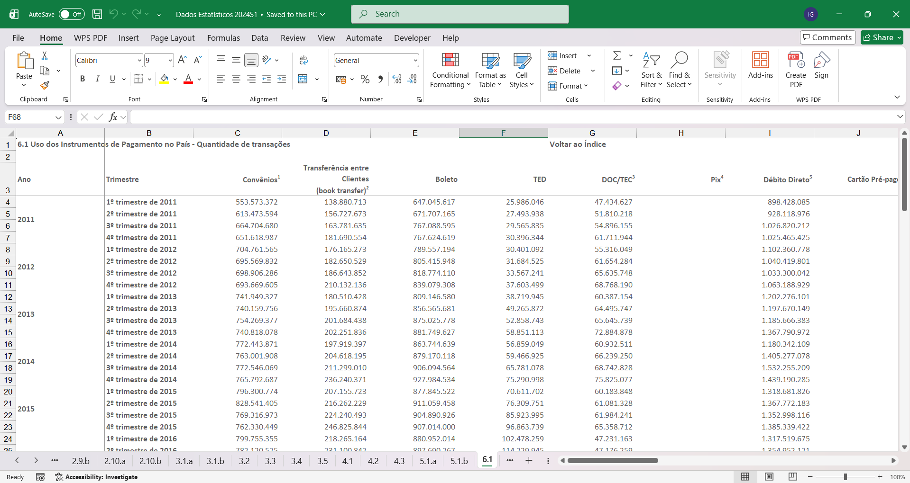
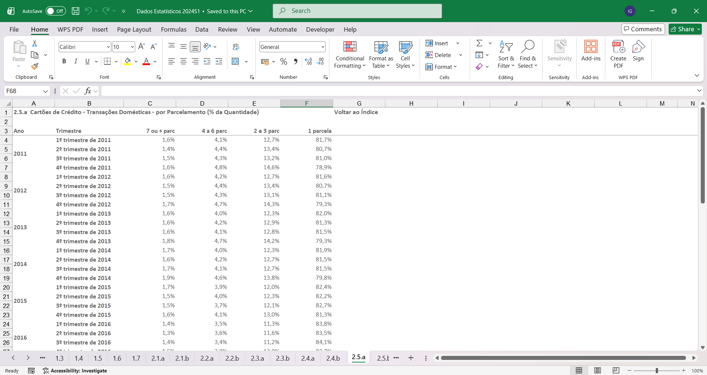

# SEÇÃO 1: SELEÇÃO DOS DADOS BRUTOS

Nesta aba, encontra-se o modo/maneira de seleção dos dados brutos para efetuar a análise dos dados.

## Como foi feita a seleção?

De maneira geral, realizar um projeto como este não exige a seleção de dados especifícos como: Economia, Vendas, Desenvolvimento do Mercado, dentre outros. Para selecionar uma boa base de dados, é importante ter em mente duas coisas:

1. **Delimitar um objetivo sólido**: Quando construimos um projeto como esse tentamos alcançar determinado objetivo, ele pode ser pessoal, profissional ou até técnico. Por exemplo:

        "Tenho interesse no ramo cinematográfico. Então posso procurar por uma base de dados que demonstre a participação do cinema brasileiro dentro do cenário global."

Referente ao projeto que desenvolvi, eu delimitei o seguinte objetivo: 

        "Quero uma base de dados densa, que exiga uma análise detalhada, e que remeta a um ambiente bancário"

2. **Sites Confiáveis**: Há inúmeros sites que englobam vários banco de dados de variáveis temas. Alguns exemplos: 

[Kaggle](https://www.kaggle.com/datasets),
[Google Dataset Search](https://datasetsearch.research.google.com/), [FGV-Fundação Getúlio Vargas](https://analytics.fgv.br/), [Bacen](https://www.bcb.gov.br/).

Dentre os citados, o utilizado nesse projeto foi um banco de dados do Bacen. Irei detalhar melhor na próxima parte.

## Bacen: Dados estatísticos dos Meios de Pagamento
Após ter delimitado o objetivo do meu projeto, pesquisado dentre os sites mencionado, selecionei a pesquisa que mais chamativa e que aparentava ser compatível com meu objetivo.

O banco de dados que mais me interessou foi uma pesquisa realizada pelo Bacen sobre: **O uso dos meios de pagamento e as transferências de créditos no país**. A pesquisa foi realizada desde 2009 e foi descontinuada em 2024. 

O fator que colaborou para sua seleção foi a possibilidade de analisar a tendência de pagamento dos brasileiros. Como a população nacional utiliza dos recursos disponíveis e quais são os mais discrepantes. Ainda assim, a pesquisa não responde a motivação das escolhas, mas, isso não anula a relevância dos dados que o compõem.

É possível acessar o banco de dados que utilizei por aqui: [Banco de dados - Uso dos Meios de Pagamento](https://www.bcb.gov.br/estatisticas/spbadendos?ano=2024)

## Imagens do Banco de Dados

**IMPORTANTE!**: Todas as fotos mostradas nesta seção se referem a um preview de algumas tabelas usadas no Dashboard.

