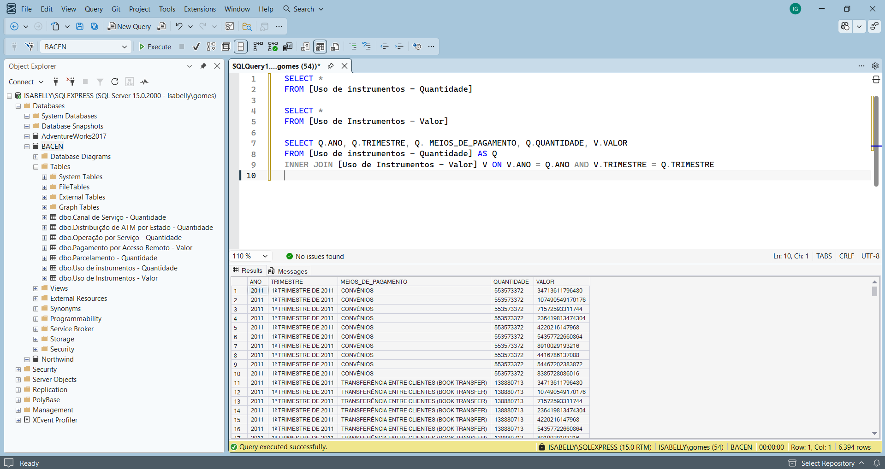

# SEÇÃO 3: CRIAÇÃO DE UM BANCO DE DADOS

Nessa seção explicarei como desenvolvi o banco de dados desse projeto e como o utilizei.

## Importando os dados 
Como dito anteriormente, os dados foram salvos em CSV para permiter a leitura do documento e alteração no banco de dados.

1. Criação do Banco de Dados: Utilizei o SQL Server para criar um Banco de Dados.
2. Importação: Importei os arquivos manualmente no SQL utilizando a função Tasks.

## Aplicação dos Filtros
Nessa etapa, foi realizado filtros para melhorar a visualização dos dados antes de exportá-los ao Power BI. 

Foi aplica apenas um filtro, o **INNER JOIN** para unir os resultados de duas tabelas em apenas uma. 

        SELECT Q.ANO, Q.TRIMESTRE, Q. MEIOS_DE_PAGAMENTO, Q.QUANTIDADE, V.VALOR
        FROM [Uso de instrumentos - Quantidade] AS Q
        INNER JOIN [Uso de Instrumentos - Valor] V ON V.ANO = Q.ANO AND V.TRIMESTRE = Q.TRIMESTRE

A etapa do banco de dados foi simples devido o tratamento anterior dos dados e a seleção pré-determinada das tabelas que seriam utilizadas. Isso facilitou a compactação dos dados sem que precisasse de inúmeros filtros para a exportação.

## Imagem do Banco de Dados

## Ferramentas utilizadas

