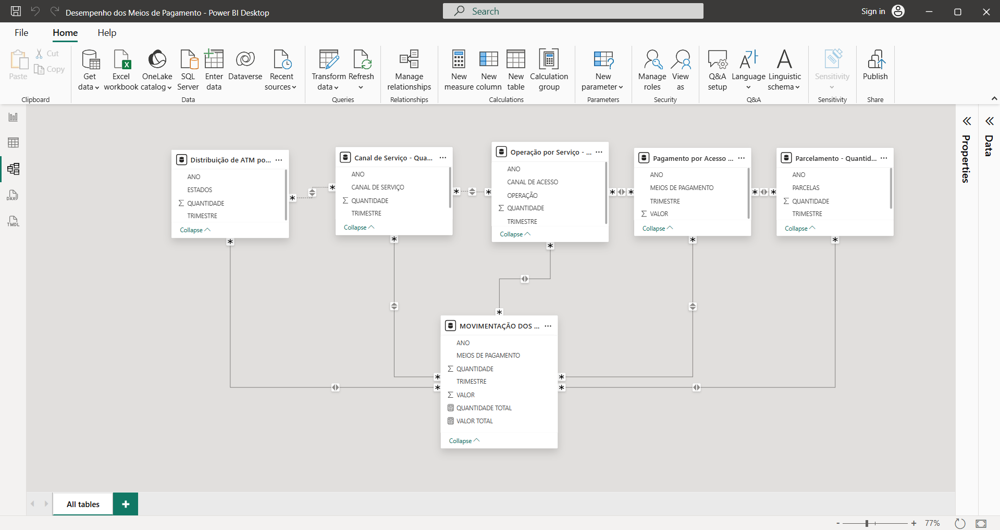

# SEÇÃO 4: Construção de um Dashboard

Na seção final, encontra-se a parte mais divertida ou interessante de todo o projeto, a elaoração de uma visualização dinâmica dos resultados da pesquisa, o Dashboard.

## Tratando os dados no Power BI

Antes de tudo, mesmo que todos os dados tenham passado por tratamento, o SQL pode cometer erros e não exportá-los corretamente. No meu caso, precisei apenas tratar uma tabela, em que nela não continha os títulos. 

Logo, é importante que indepedente das inúmeras etapas de tratamento, sempre clique em *Transformar os Dados* ao invés de exportá-los diretamente no BI. Apenas para verificar se os dados continuam íntegros.

## Criação de Relações
Para garantir o dinamismo e conexão das tabelas deve criar as relações entre elas. Na maioria das vezes, o Power BI identifica as relações e as correlaciona automaticamente, mas depedendo do caso, é preciso criar manualmente. 

No meu caso, por se tratar de dados que não continham uma **tabela fato** (Uma tabela extensa que une os dados das tabelas de dimensão), então tive que realizar a relação manual.

Como demonstrado na imagem, por não ter uma tabela fato e todas serem tabelas dimensões, tive que realizar a conexão entre elas mesmas para garantir a conectividade. 

## Criação do Design
Como dito, é a parte mais legal e, possivelmente, a mais fácil. Já que todo o tratamento e análise já foram feitos, agora é preciso demonstrar isso de maneira visual.

### Seleção da Cor

O objetivo do design era ser: Profissional, Polído e Confortável Visualmente.

Com isso, apostei em cores neutras no fundo e em cores escuras nas barras, colunas e KPIS para dar contraste aos valores.

Para chegar nessa paleta de cores, utilizei o [Color Hex](https://www.color-hex.com/) que mostrar as paletas de cores correspondentes a cor desejada.

### Escolha de Gráficos 
A seleção dos gráficos também foi pré-determinada e escolhida a dedo.

- **COLUNAS**: Selecionei esse por facilitar a visualização dos dados, tendo em vista que o banco de dados continham inúmeros valores. Além de permitir analisar por meio e uma escala *Crescente*. 
- **LINHAS**: Usado para realizar uma comparação dentro de uma linha do tempo, entre o DOC e o PIX.
- **FUNIL**: Esse gráfico foi selecionado pela sua capacidade de demonstrar a influência ou tendência de um valor/objeto dentro de um todo, sendo perfeito para a visualização da *tendência do parcelamento*.

## Imagem do Projeto final

## Ferramentas Utilizadas

